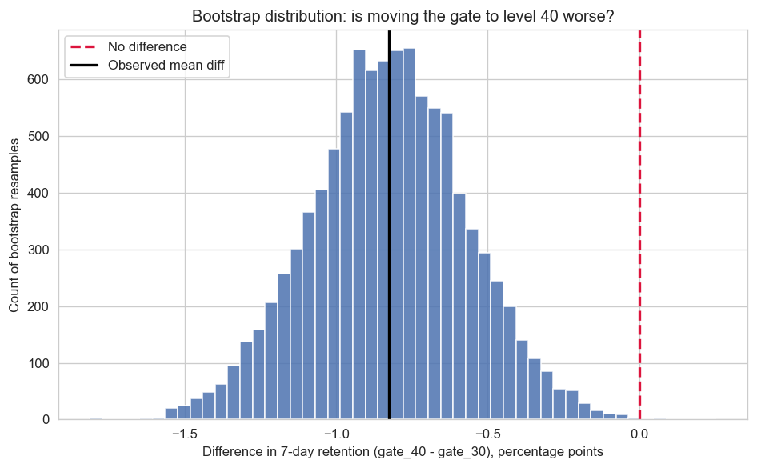

# A/B Test Analysis — Cookie Cats

Does moving a mobile game's first progression gate from **level 30** to **level 40**
help or hurt player retention? This project analyzes a real A/B test of ~90,000 players
and turns the result into a ship / don't-ship recommendation.



## The 5 questions

1. **What business problem?** Cookie Cats wants to move its first gate later (level 30 → 40).
   The gate is where players wait or pay to continue, so it directly affects whether players
   come back. Retention is the metric that matters.
2. **Why does it matter?** In free-to-play games, retention drives revenue. A small change to
   retention scales across a very large player base.
3. **Why this approach?** 7 day retention as the primary metric (a stronger signal of lasting
   engagement than 1 day); two-proportion tests for binary retention; a bootstrap to show
   uncertainty; Holm correction because we test more than one metric.
4. **What trade-offs?** [fill in: the outlier decision, the SRM finding, whether
   the test was adequately powered, what the data can't tell us].
5. **What would you improve?** [fill in: longer retention horizon, revenue as a
   guardrail, segmenting by player type, sequential testing].

## What's inside

- `notebooks/ab_test_analysis.ipynb` - the full analysis
- `images/` - plots

## Method highlights

- **Sample Ratio Mismatch check** before trusting the result
- **Two-proportion z-test** with a confidence interval on the difference
- **Bootstrap** of the retention difference to visualize uncertainty
- **Holm–Bonferroni correction** across retention metrics
- **Mann–Whitney U** for the skewed game-rounds metric

## Data

Cookie Cats A/B test dataset (~90,189 players). Not included in the repo; download separately
and place at `data/cookie_cats.csv`.

## How to run

```bash
pip install pandas numpy matplotlib seaborn scipy statsmodels
jupyter notebook notebooks/ab_test_analysis.ipynb
```